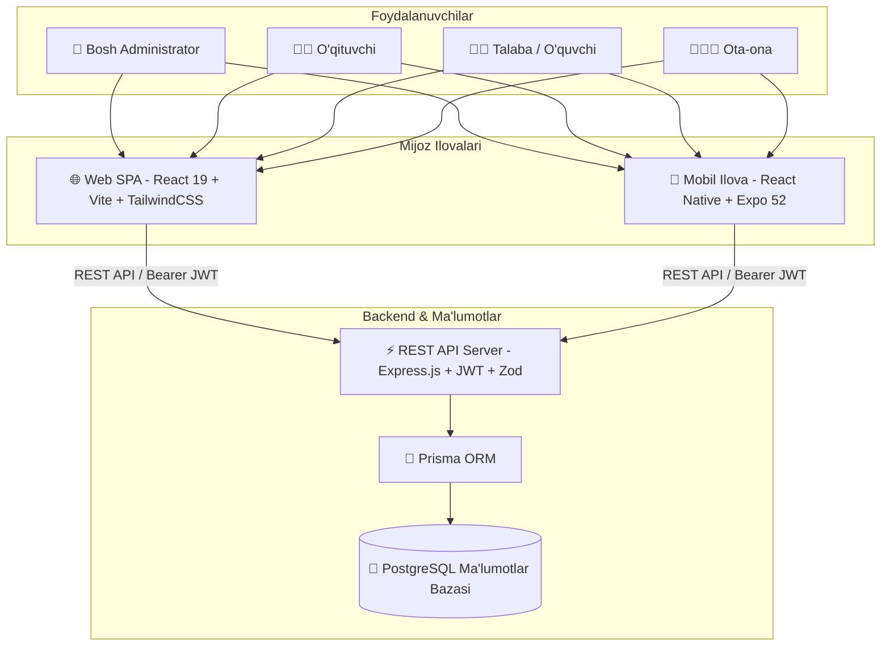

# 🎓 EduFlow — Zamonaviy Taʼlim Boshqaruv Tizimi (LMS & CRM)

<div align="center">


[](https://react.dev/)
[](https://www.typescriptlang.org/)
[](https://nodejs.org/)
[](https://expressjs.com/)
[](https://www.prisma.io/)
[](https://www.postgresql.org/)
[](https://expo.dev/)

<p align="center">
  <b>O'quv markazlari, maktablar va universitetlar uchun to'liq avtomatlashtirilgan ko'p platformali (Web, Mobile, Backend REST API) boshqaruv tizimi.</b>
</p>

[Jonli API](https://eduflow-reny.onrender.com/api) • [Swagger Hujjatlari](https://eduflow-reny.onrender.com/api/docs) • [API Salomatligi](https://eduflow-reny.onrender.com/api/health) • [24/7 Keep-Alive](https://eduflow-reny.onrender.com/api/ping)

</div>

---

## 🏛 Tizim Arxitekturasi

EduFlow monorepo arxitekturasi 3 ta mustaqil va bir-biri bilan to'liq integratsiya qilingan qatlamdan iborat:



---

## 📱 4 ta Foydalanuvchi Roli va Imkoniyatlari

| Rol | Veb Portal | Mobil Ilova | Asosiy Vazifalar |
|---|:---:|:---:|---|
| **👑 Bosh Administrator** | ✅ | ✅ | Talabalar, o'qituvchilar, guruhlar, kurslar, moliyaviy hisobotlar, to'lov kvitansiyalari, tizim nazorati |
| **👨‍🏫 O'qituvchi** | ✅ | ✅ | Guruhlarga dars jadvallari, interaktiv davomat belgilash (Bor, Yo'q, Sababli), baholash (0-100), uy vazifalari yuklash |
| **👨‍🎓 Talaba / O'quvchi** | ✅ | ✅ | Shaxsiy dars jadvali, GPA va baholar daftari, davomat foizi monitoringi, uy vazifalari topshirish, to'lov holati |
| **👨‍👩‍👦 Ota-ona** | ✅ | ✅ | Farzandining kunlik davomati, yangi baholari va o'qituvchi izohlari, to'lov holati va cheklar |

---

## 🗂 Repozitoriy Strukturasi

```text
EduFlow/
├── eduflow-backend/          # REST API server (Node.js, Express, Prisma, PostgreSQL)
│   ├── prisma/               # Prisma sxemasi va ma'lumotlar seed skripti
│   ├── routes/               # 9 ta asosiy modul (auth, students, teachers, groups, courses, attendance, payments, grades, homework)
│   ├── middleware/           # RBAC, JWT tekshiruvi, xatoliklar boshqaruvi
│   ├── validators/           # Zod validatsiya sxemalari
│   ├── audit_test_suite.js   # Barcha 9 modul va 4 rol uchun avtomatlashtirilgan QA testlari
│   └── server.js             # Express serveri va Keep-Alive 24/7 pinger
│
├── frontend/                 # Veb SPA (React 19, TypeScript, Vite, TailwindCSS)
│   ├── src/components/       # Reusable UI elementlari va layoutlar
│   ├── src/context/          # Global holat va autentifikatsiya
│   ├── src/pages/            # 4 rol uchun boshqaruv panellari
│   └── src/services/         # Backend REST API bilan aloqa xizmati
│
├── mobile/                   # Kross-platforma mobil ilova (React Native, Expo 52)
│   ├── src/navigation/       # Root va Role-based pastki tab navigatorlari
│   ├── src/screens/          # Barcha 4 rol uchun ekranlar (Admin, Teacher, Student, Parent)
│   ├── src/components/       # Mobil UI komponentlari (Card, Button, Badge, Header)
│   ├── src/context/          # Offline/Online gibrid ma'lumotlar va til tanlash (UZ/RU/EN)
│   └── eas.json              # Android APK va iOS build konfiguratsiyasi
│
├── package.json              # Monorepo yagona boshqaruv skriptlari
└── README.md                 # Asosiy hujjatlar
```

---

## 🚀 Tezkor Ishga Tushirish (Getting Started)

### Talablar
- [Node.js](https://nodejs.org/) v18 yoki v20+
- [Git](https://git-scm.com/)

---

### 1. Barcha Bog'liqliklarni O'rnatish

```bash
# Backend paketlarini o'rnatish
npm install --prefix eduflow-backend

# Frontend paketlarini o'rnatish
npm install --prefix frontend

# Mobil ilova paketlarini o'rnatish
npm install --prefix mobile
```

---

### 2. Backend Serverni Ishga Tushirish

```bash
# PostgreSQL ulanishi va migratsiyani amalga oshirish:
npm run prisma:generate --prefix eduflow-backend
npm run prisma:seed --prefix eduflow-backend

# Serverni ishga tushirish (http://localhost:5000):
npm run backend:dev
```

---

### 3. Veb Frontendni Ishga Tushirish

```bash
# Frontendni ishlab chiqish rejimida ishga tushirish (http://localhost:5173):
npm run dev
```

---

### 3.1 Docker Orqali PostgreSQL ni 1 Buyruqda Ishga Tushirish (Ixtiyoriy)

Agar kompyuteringizda PostgreSQL o'rnatilmagan bo'lsa:
```bash
# PostgreSQL va Adminer (http://localhost:8080) ni ishga tushirish:
npm run docker:up

# To'xtatish:
npm run docker:down
```

---

### 4. Mobil Ilovani Ishga Tushirish

```bash
# Expo dev-serverni ishga tushirish (QR kod terminalda paydo bo'ladi):
npm run mobile

# Brauzerda (Web rejimida) ko'rish:
npm run mobile:web

# Android emulyatorida:
npm run mobile:android

# iOS simulyatorida (macOS talab etiladi):
npm run mobile:ios
```

---

## 🔑 Demo Kirish Ma'lumotlari (Seed Data)

Barcha rollar uchun demo tizimga kirish akkauntlari:

| Rol | Email | Parol | Ruxsatlar darajasi |
|---|---|---|---|
| **Administrator** | `admin@eduflow.uz` | `0603` yoki `admin123` | To'liq tizim (Superadmin) |
| **O'qituvchi** | `teacher1@eduflow.uz` | `teacher123` | Darslar, davomat, baholar, vazifalar |
| **Talaba** | `student1@eduflow.uz` | `student123` | Jadval, baholar, davomat, to'lov |
| **Ota-ona** | `parent@eduflow.uz` | `parent123` | Farzand nazorati, to'lovlar |

---

## 📦 Android APK Generatsiya Qilish (EAS Build)

Mobil ilovani mustaqil `.apk` fayl holida yig'ish:

```bash
cd mobile
npx eas-cli build -p android --profile preview
```

---

## 🧪 Sifat Nazorati va QA Sinovlari

Backend API ning barcha 9 ta moduli, RBAC ruxsatlari va Zod validatsiyalarini bir zumda to'liq tekshirish:

```bash
cd eduflow-backend
node audit_test_suite.js
```

---

## 🌐 24/7 Keep-Alive Ping Xizmati

EduFlow bepul bulutli serverlarda (masalan, Render.com) 15 daqiqa harakatsizlikdan so'ng uyquga ketishining oldini olish uchun ichki o'z-o'zini uyg'otuvchi ping servisi (`/api/ping`) bilan jihozlangan. Har 10 daqiqada avtomatik so'rov yuborilib, tizim 24/7 uzluksiz rejimda ishlaydi.

---

## 📄 Litsenziya

EduFlow — O'zbekistonda zamonaviy raqamli ta'lim tizimlarini rivojlantirish uchun yaratilgan xususiy platforma.
